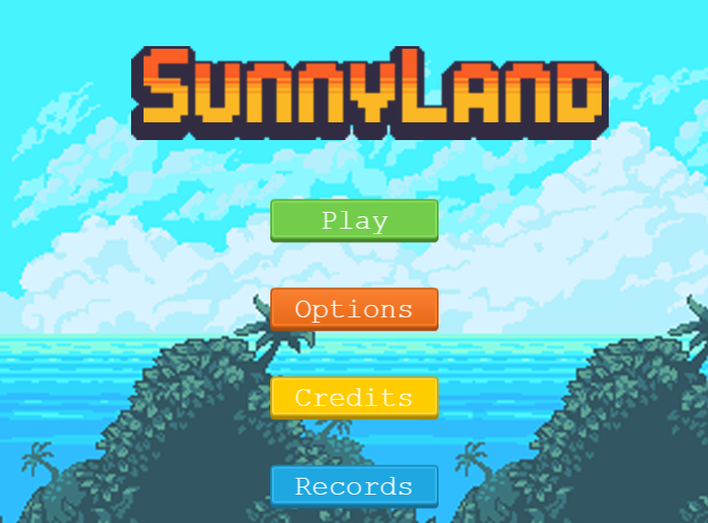

**🎮️ Name of the game: Sunny land\
👥 Stakeholders:**

- Dev: [Victor Pacheco](https://github.com/vichuge)
- Design: [Luis Zuno](https://www.patreon.com/ansimuz)

# Overview

## 📐 Project scope

- **Timeline: Within 5 working days**

## 🗣️ Elevator Pitch

_It's a 2d game with a cute fox who set himself out for an endless adventure to jump collect gems and avoid frogs on speeding various platforms_

# Story

_A good fox starts his endless journey to collect gems and avoid bad frogs._

# Gameplay

The cute fox can jump once, and twice in midst of air defying rules of physics and allowing him to avoid falling to infinity or falling.

## Core Game Mechanic

- Details: Build platform game with Phaser3 Library
- How it works: Using Phaser3 JS library to create the canvas and different scenes.
- Details: Add platform and player sprite & Animate it.
- How it works: Collected assets from different resources and used Phaser3 to animate and edit different features like size, respawn, velocity, movement, color.
- Details: Add game objects
- How it works: Added glowing animated gems and deadly frogs, the score is modified upon collecting gems and restarting if you the character dies.
- Details: Add a scoreboard
- How it works: Use API to store player name and score if your score is more than the hall of fame (top 3).

# Game elements

# 👤 Characters / 📦️ Objects

- Fox
- Frog
- Gem
- Platform
- Background

## 🏆️ missions

- Cath all gems, 1 gem = 10 score
- Avoid be poisoned from frogs
- Avoid falling

# Assets

## 🎨 Art

- [Art Assets: Blue sky with grass background, houses, trees, frogs, box, fox, platform by: Luis Zuno](https://www.patreon.com/ansimuz)
- [UI Assets: Buttons by: Kenney Vleugels](https://www.kenney.nl/)

## 🔊 Sound

- [Soun efects by: opengameart.org ](https://opengameart.org/)
- Music by Pascal Belisle

## 🏃‍ Animations

- Walk fox
- Jump fox
- stay frog
- spin gem