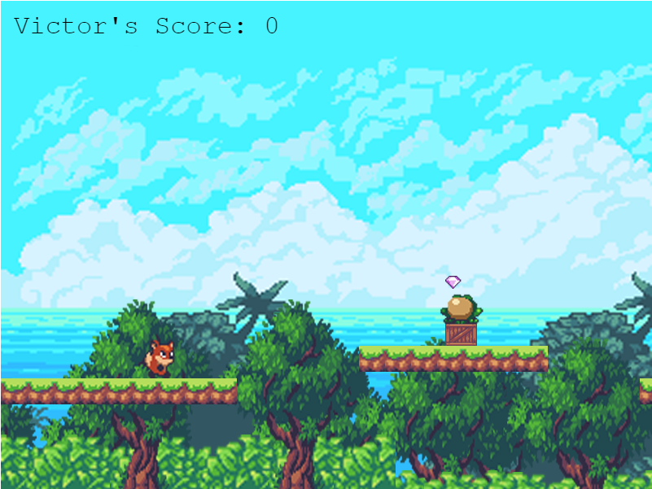

# Sunny Land (Platform game capstone project)

> It's a 2d game with a cute fox who set himself out for an endless adventure to jump collect gems and avoid frogs on speeding various platforms



## Built With

- HTML
- Phaser
- JavaScript
- ES6
- Webpack
- Jest

## Live Demo

**If the game take too long to load OR stuck at 91% just press f5** <br>
[Live Demo Link](https://vichuge.github.io/js-capstone-endless-runner/)

## Game Design Documment

This is a game based on an endless running journey and the hero is a cute fox with a mission to collect as many gems as possible to come as number 1 on the leaderboard.
He must avoid frogs and falling or otherwise he meets his doom.
The cute fox can jump once, and twice in midst of air defying rules of physics and allowing him to avoid falling to infinity or falling.
[Game Design Document (GDD) Link](./GDD.md)

### How to play

- JUMP:
  [ Left click ]

### Prerequisites

- Live Server plugin for Visual Studio Code

### Setup

1- Clone the repository

```
    git clone https://github.com/vichuge/js-capstone-endless-runner.git
```

2- Open the folder on VS Code.

3- install Packages

```
    npm install
```

3- Run live server

```
    npm run watch / npm run start
```

4- Everything should be running by now.

### Testing

Run the next on your terminal in the repository folder:

```
    npm run test
```

## Author

👤 **Victor Pacheco**

- GitHub: [@vichuge](https://github.com/vichuge)
- LinkedIn: [LinkedIn](https://www.linkedin.com/in/victor-pacheco-7946aab2/)
- Twitter: [@Pachecofloresv](https://twitter.com/Pachecofloresv)

## Show your support

Give a ⭐️ if you like this project!

## Acknowledgments

- Artwork created by Luis Zuno [@ansimuz](https://www.patreon.com/ansimuz)
- Music by Pascal Belisle
- UI pack by [Kenney Vleugels](https://www.kenney.nl/)
- sound effects by [opengameart.org](https://opengameart.org/)